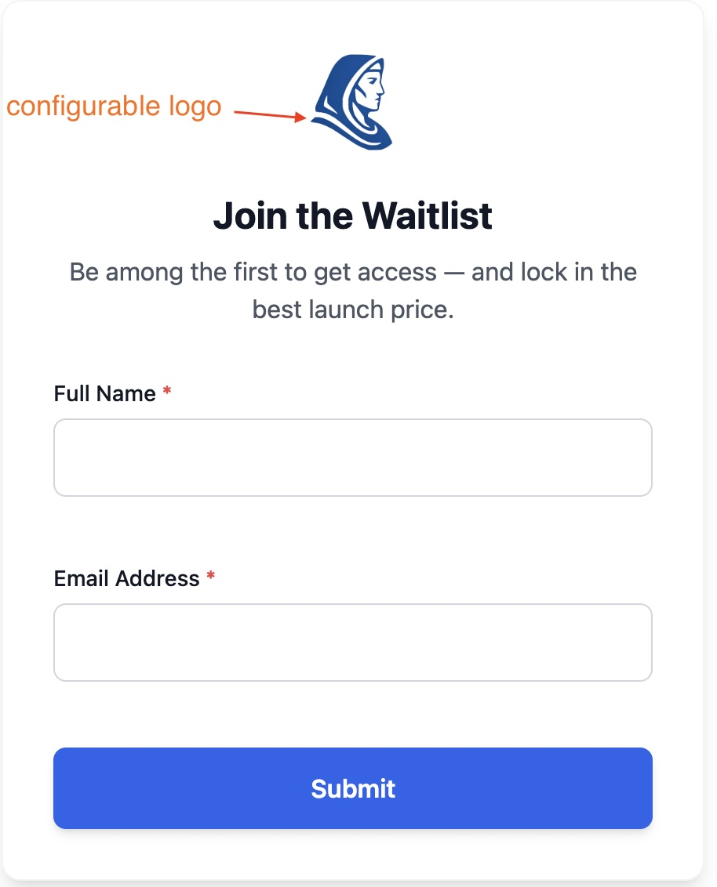
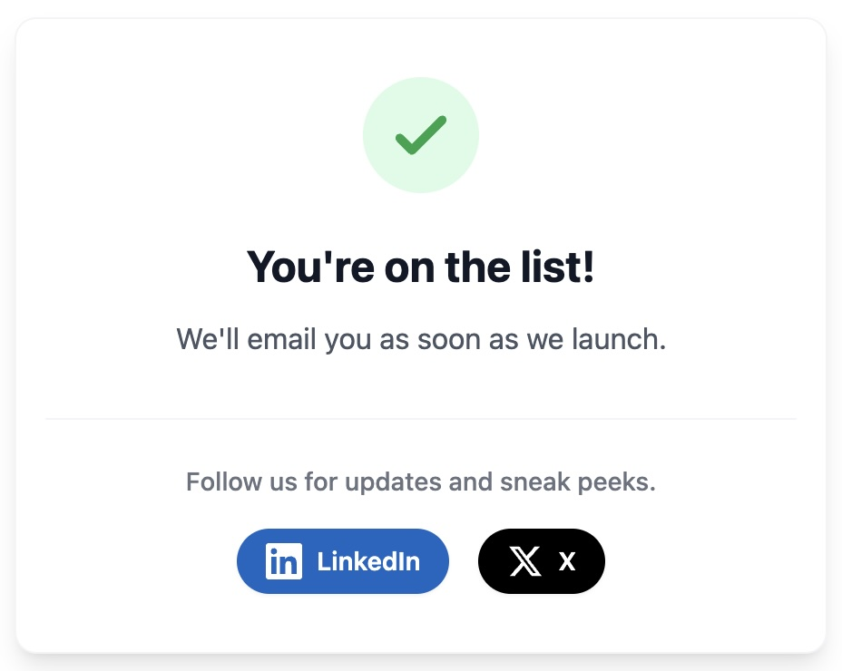
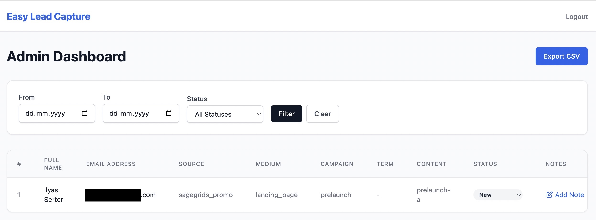

# Easy Lead Capture

A lightweight, embeddable lead capture system for PHP. Beautiful forms, SQLite storage, email notifications, optional reCAPTCHA v3 — all in a single Composer package with zero build steps for consumers.

## Features

- **Embeddable lead forms** — iframe or JS snippet, works on any website
- **Configurable fields** — text, email, phone, URL, textarea, multi-select checkboxes
- **Pre-compiled Tailwind CSS** — beautiful out of the box (~15KB), customizable colors
- **SQLite storage** — zero database setup, WAL mode enabled
- **Email notifications** — SMTP, Sendmail, or SES (sent after response for fast submissions)
- **API ping** — POST lead data to your own API/webhook on each submission (deferred)
- **reCAPTCHA v3** — optional, configurable score threshold
- **Admin panel** — view leads, filter by date, export CSV
- **Lightweight** — <20KB iframe payload, no frontend framework

## Screenshots

### Lead Form


### Success Message


### Admin Panel


## Quick Start

### 1. Install

```bash
composer require iserter/easy-lead-capture
```

### 2. Configure

Create `public/lead-capture/index.php`:

```php
<?php
require __DIR__ . '/../../vendor/autoload.php';

$app = new Iserter\EasyLeadCapture\App([
    'base_path' => '/lead-capture',
    'admin' => [
        'password' => password_hash('your-password', PASSWORD_DEFAULT),
        'email' => 'you@example.com',
        'linkedin_url' => 'https://www.linkedin.com/in/yourprofile',
        'x_url' => 'https://x.com/yourhandle',
    ],
    'form' => [
        'headline' => 'Join the Waitlist',
        'intro_text' => 'Be the first to know when we launch.',
        'fields' => [
            'name'  => ['label' => 'Name', 'required' => true],
            'email' => ['label' => 'E-mail', 'required' => true],
            'phone' => ['label' => 'Phone', 'required' => false],
        ],
    ],
    'on_submit' => [
        'success_headline' => 'Thank you!',
        'success_message' => 'We will get back to you soon.',
        'social_links' => [
            'enabled' => true,
            'message' => 'Follow us for updates.',
        ],
        'ping_api' => [
            'enabled' => false,
            'api_endpoint' => 'https://example.com/api/leads',
            'api_key' => '',
        ],
    ],
    'mail' => [
        'from' => ['address' => 'hello@example.com', 'name' => 'My App'],
        'mailer' => 'smtp',
        'smtp' => [
            'host' => '127.0.0.1',
            'port' => 587,
            'username' => '',
            'password' => '',
        ],
    ],
]);

$app->run();
```

Add the provided `.htaccess` to the same directory for Apache, or configure nginx to route requests to `index.php`.

### 3. Embed

**iframe (recommended):**
```html
<iframe src="https://yoursite.com/lead-capture/form"
        style="border:none; width:100%; height:500px;"
        loading="lazy">
</iframe>
```

**JavaScript loader:**
```html
<script src="https://yoursite.com/lead-capture/embed.js"></script>
<div id="lead-form"></div>
<script>EasyLeadCapture.render('#lead-form');</script>
```

### Source tracking

Allow capturing UTM parameters from the embed URL. These values appear in the admin panel, CSV export, email notifications, and API ping payload.

**iframe:**
```html
<iframe src="https://yoursite.com/lead-capture/form?utm_source=google&utm_medium=cpc" ...></iframe>
```

**JavaScript loader:**
```js
EasyLeadCapture.render('#lead-form', {
  params: {
    utm_source: 'google',
    utm_medium: 'cpc'
  }
});
```

### 4. Admin Panel

Visit `/lead-capture/admin` to view captured leads and export as CSV.

## Requirements

- PHP 8.1+
- SQLite3 extension
- Composer

## Development & Releasing

This project uses [Conventional Commits](https://www.conventionalcommits.org/) and [Release Please](https://github.com/googleapis/release-please-action) to automate versioning and changelog generation.

### Commit Message Format

Each commit message should follow this structure:
`<type>[optional scope]: <description>`

| Type | Description | SemVer Impact |
| :--- | :--- | :--- |
| `fix` | A bug fix | patch |
| `feat` | A new feature | minor |
| `feat!` / `fix!` | Breaking change | major |
| `chore`, `docs`, `test` | Internal changes | none |

Example: `feat: add recaptcha v3 support`

### Releasing

1. Merge your changes to `main` using Conventional Commit messages.
2. Release Please will automatically open or update a **Release PR** (e.g., `chore(main): release 1.0.0`).
3. Merging the Release PR will:
   - Tag the release (e.g., `v1.0.0`)
   - Create a GitHub Release with the changelog
   - Update `composer.json` and `CHANGELOG.md`

## License

MIT
